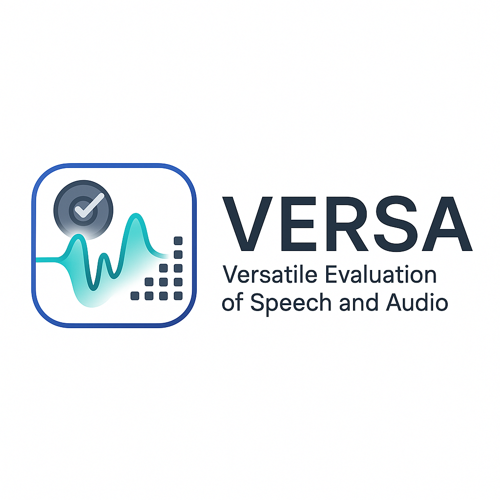

<div align="left"></div>

# VERSA: Versatile Evaluation of Speech and Audio

[](https://github.com/wavlab-speech/versa/stargazers)
[](https://badge.fury.io/py/versa)
[](https://opensource.org/licenses/MIT)

VERSA (Versatile Evaluation of Speech and Audio) is a comprehensive toolkit for evaluating speech and audio quality. It provides seamless access to over 80 evaluation/profiling metrics with 10x variants, enabling researchers and developers to assess audio quality through multiple dimensions.

## 🚀 Features

- **Comprehensive**: 80+ metrics covering perceptual quality, intelligibility, and technical measurements (check [full metrics documentation](https://github.com/wavlab-speech/versa/blob/main/supported_metrics.md) for a complete list)
- **Integrated**: Tightly integrated with [ESPnet](https://github.com/espnet/espnet.git)
- **Flexible**: Support for various input formats (file paths, SCP files, Kaldi-style ARKs)
- **Scalable**: Built-in support for distributed evaluation using Slurm

## 🔍 Interactive Demo

Try our interactive demo from the Interspeech 2024 Tutorial:
[Colab Demonstration](https://colab.research.google.com/drive/11c0vZxbSa8invMSfqM999tI3MnyAVsOp?usp=sharing)

## 📦 Installation

### Basic Installation

```bash
git clone https://github.com/wavlab-speech/versa.git
cd versa
pip install .
```

### Metric-Specific Dependencies

VERSA aligns with original APIs provided by algorithm developers rather than redistributing models. The core package includes many metrics by default, but some require additional installation.

For metrics marked without "x" in the "Auto-Install" column of our metrics tables, please check the [installation guide](https://github.com/wavlab-speech/versa?tab=readme-ov-file#list-of-metrics) or use the installers provided in the `tools` directory.


## 🧪 Quick Testing

```bash
# Test core functionality
python versa/test/test_general.py

# Test specific metrics that require additional installation
python versa/test/test_{metric}.py
```


## 🔧 Usage Examples

### Basic Usage

```bash
# Direct usage with file paths
python versa/bin/scorer.py \
    --score_config egs/speech.yaml \
    --gt test/test_samples/test1 \
    --pred test/test_samples/test2 \
    --output_file test_result

# With SCP-style input
python versa/bin/scorer.py \
    --score_config egs/speech.yaml \
    --gt test/test_samples/test1.scp \
    --pred test/test_samples/test2.scp \
    --output_file test_result

# With Kaldi-ARK style input
python versa/bin/scorer.py \
    --score_config egs/speech.yaml \
    --gt test/test_samples/test1.scp \
    --pred test/test_samples/test2.scp \
    --output_file test_result \
    --io kaldi
  
# Including text transcription information
python versa/bin/scorer.py \
    --score_config egs/separate_metrics/wer.yaml \
    --gt test/test_samples/test1.scp \
    --pred test/test_samples/test2.scp \
    --output_file test_result \
    --text test/test_samples/text
```

### Distributed Evaluation with Slurm

```bash
# Option 1: With ground truth speech
./launch.sh \
  <pred_speech_scp> \
  <gt_speech_scp> \
  <score_dir> \
  <split_job_num> 

# Option 2: Without ground truth speech
./launch.sh \
  <pred_speech_scp> \
  None \
  <score_dir> \
  <split_job_num>

# Aggregate results
cat <score_dir>/result/*.result.cpu.txt > <score_dir>/utt_result.cpu.txt
cat <score_dir>/result/*.result.gpu.txt > <score_dir>/utt_result.gpu.txt

# Visualize results
python scripts/show_result.py <score_dir>/utt_result.cpu.txt
python scripts/show_result.py <score_dir>/utt_result.gpu.txt 
```

Explore `egs/*.yaml` for configuration examples for different evaluation scenarios.

## 📊 Supported Metrics

VERSA organizes metrics into four categories:

1. **Independent Metrics** - Standalone metrics that don't require reference audio
2. **Dependent Metrics** - Metrics that compare predicted audio against reference audio
3. **Non-match Metrics** - Metrics that work with non-matching references or information from other modalities
4. **Distributional Metrics** - Metrics that evaluate statistical properties of audio collections

*See the [full metrics documentation](https://github.com/wavlab-speech/versa/blob/main/supported_metrics.md) for a complete list with references.*

## 📝 Citation

If you use VERSA in your research, please cite our papers:

```bibtex
@inproceedings{shi2025versa,
title={{VERSA}: A Versatile Evaluation Toolkit for Speech, Audio, and Music},
author={Jiatong Shi and Hye-jin Shim and Jinchuan Tian and Siddhant Arora and Haibin Wu and Darius Petermann and Jia Qi Yip and You Zhang and Yuxun Tang and Wangyou Zhang and Dareen Safar Alharthi and Yichen Huang and Koichi Saito and Jionghao Han and Yiwen Zhao and Chris Donahue and Shinji Watanabe},
booktitle={2025 Annual Conference of the North American Chapter of the Association for Computational Linguistics -- System Demonstration Track},
year={2025},
url={https://openreview.net/forum?id=zU0hmbnyQm}
}

@inproceedings{shi2024versaversatileevaluationtoolkit,
  author={Shi, Jiatong and Tian, Jinchuan and Wu, Yihan and Jung, Jee-Weon and Yip, Jia Qi and Masuyama, Yoshiki and Chen, William and Wu, Yuning and Tang, Yuxun and Baali, Massa and Alharthi, Dareen and Zhang, Dong and Deng, Ruifan and Srivastava, Tejes and Wu, Haibin and Liu, Alexander and Raj, Bhiksha and Jin, Qin and Song, Ruihua and Watanabe, Shinji},
  booktitle={2024 IEEE Spoken Language Technology Workshop (SLT)}, 
  title={ESPnet-Codec: Comprehensive Training and Evaluation of Neural Codecs For Audio, Music, and Speech}, 
  year={2024},
  pages={562-569},
  keywords={Training;Measurement;Codecs;Speech coding;Conferences;Focusing;Neural codecs;codec evaluation},
  doi={10.1109/SLT61566.2024.10832289}
}
```

## 🙏 Acknowledgement

We sincerely thank all the authors of the open-source implementations listed in our [metrics documentation](https://github.com/wavlab-speech/versa/blob/main/supported_metrics.md).

## 🤝 Contributing

Contributions are welcome! Please feel free to submit a Pull Request. Please check the [contributing guideline](https://github.com/wavlab-speech/versa/blob/main/contributing.md) first.

## 📄 License

This project is licensed under the MIT License - see the LICENSE file for details.
