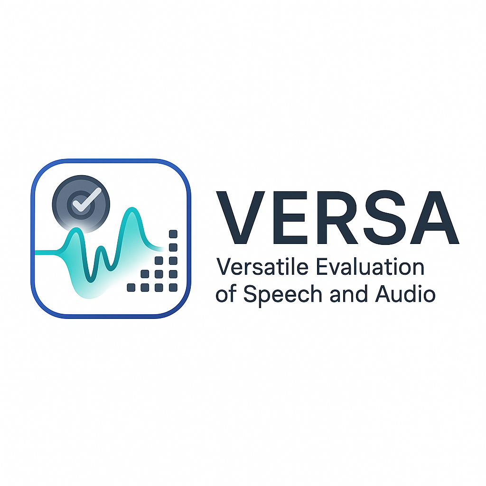

<div align="left"></div>

# VERSA: Versatile Evaluation of Speech and Audio

[](https://github.com/wavlab-speech/versa/stargazers)

[](https://opensource.org/licenses/MIT)
[](https://arxiv.org/abs/2412.17667)
[](https://github.com/psf/black)

VERSA (Versatile Evaluation of Speech and Audio) is a comprehensive toolkit for evaluating speech and audio quality. It provides seamless access to over 90 evaluation/profiling metrics with 10x variants, enabling researchers and developers to assess audio quality through multiple dimensions.

## 🚨 Exciting News
- Sep 2025 - Add visualization and text LLM summarization supports for VERSA-v2.
- Jun 2025 - Update launch scripts for local machine to support multi-process/multi-gpu (automatic rank assignment) for VERSA.
- May 2025 – VERSA presented at NAACL 2025, showcasing its unified multi-metric evaluation framework for speech and audio ([🎥 Presentation Video](https://www.youtube.com/watch?v=e7TdOlzyJcE))
- Feb 2025 – Integrated support for Qwen2-Audio-based perceptual metrics, extending VERSA's capacity for LLM-informed audio quality profiling
- Dec 2024 – Official release of VERSA v1.0, featuring 90+ evaluation metrics and full integration with ESPnet and Slurm-based distributed evaluation

## 🚀 Features

- **Comprehensive**: 90+ metrics covering perceptual quality, intelligibility, and technical measurements (check [full metrics documentation](https://github.com/wavlab-speech/versa/blob/main/docs/supported_metrics.md) for a complete list)
- **Integrated**: Widely used in speech toolkits and challenges (check the [incomplete list of toolkits/challenges](https://github.com/wavlab-speech/versa/blob/main/docs/users.md) using versa)
- **Flexible**: Support for various input formats (file paths, SCP files, Kaldi-style ARKs)
- **Scalable**: Built-in support for distributed evaluation using Slurm, with resume support for interrupted scoring runs
- **Visualizable**: Interactive visualization with VERSA results (check [our visualization guideline](https://github.com/wavlab-speech/versa/blob/main/docs/visualization.md))

## 🔍 Interactive Demo

Try our interactive demo from the Interspeech 2024 Tutorial:
[Colab Demonstration](https://colab.research.google.com/drive/11c0vZxbSa8invMSfqM999tI3MnyAVsOp?usp=sharing)

## 📦 Installation

### Basic Installation

```bash
git clone https://github.com/wavlab-speech/versa.git
cd versa
pip install .
```

The base install keeps dependency resolution light and includes the shared scorer
runtime. Install optional groups for metrics that need larger model stacks or
external toolkits:

```bash
pip install ".[audio,text,ml]"
pip install ".[external]"  # Git/toolkit-backed metrics
pip install ".[dev]"       # tests, linting, and formatting
```

or alternatively, without cloning:

```bash
python -m pip install git+https://github.com/wavlab-speech/versa.git#egg=versa-speech-audio-toolkit --no-build-isolation
```
### Metric-Specific Dependencies

VERSA aligns with original APIs provided by algorithm developers rather than redistributing models. The base package does not install every optional metric backend by default.

For metrics marked without "x" in the "Auto-Install" column of our metrics tables, please use the installers provided in the `tools` directory.

Some real model-backed tests and metrics also need checkpoint assets that are
too large to keep in the package. Prepare those assets in a repo-visible cache
before running the full real-model checks:

```bash
PYTHON=python tools/setup_huggingface_cache.sh
```

This populates `versa_cache/huggingface` and
`versa_cache/discrete_speech_metrics`. To reuse an existing local Hugging Face
cache without network access, run:

```bash
SOURCE_HF_CACHE="$HOME/.cache/huggingface/hub" \
VERSA_HF_LOCAL_ONLY=1 \
PYTHON=python \
tools/setup_huggingface_cache.sh
```

### Installation Notes

Some optional metric backends emit warnings during setup or first use. ESPnet may
print a `flash_attn` warning when Flash Attention is not available; VERSA can
still run metrics that do not require that backend. FADTK is only needed for
FAD/KID-style metrics and can be installed with `tools/install_fadtk.sh` when
those metrics are selected.

If NLTK downloads fail with a certificate verification error, point Python at
the certificate bundle used by `certifi` before running the tests:

```bash
export SSL_CERT_FILE=$(python -c "import certifi; print(certifi.where())")
```


## 🧪 Quick Testing

```bash
# Test dependency-light core functionality
python -m pytest test/test_metrics/test_definition.py

# Test specific metrics that require additional installation
python -m pytest test/test_metrics/test_{metric}.py

# Run real model-backed checks after preparing the visible model cache
VERSA_RUN_REAL_MODEL_TESTS=1 \
VERSA_HF_CACHE_DIR="$PWD/versa_cache/huggingface" \
VERSA_DISCRETE_SPEECH_CACHE_DIR="$PWD/versa_cache/discrete_speech_metrics" \
python -m pytest --import-mode=importlib test
```


## 🔧 Usage Examples

### Basic Usage

```bash
# Direct usage with file paths
python versa/bin/scorer.py \
    --score_config egs/speech_cpu.yaml \
    --gt test/test_samples/test1 \
    --pred test/test_samples/test2 \
    --output_file test_result \
    --io dir

# With SCP-style input
python versa/bin/scorer.py \
    --score_config egs/speech_cpu.yaml \
    --gt test/test_samples/test1.scp \
    --pred test/test_samples/test2.scp \
    --output_file test_result \
    --io soundfile

# With Kaldi-ARK style input (compatible with ESPnet)
python versa/bin/scorer.py \
    --score_config egs/speech_cpu.yaml \
    --gt test/test_samples/test1.scp \
    --pred test/test_samples/test2.scp \
    --output_file test_result \
    --io kaldi
  
# Including text transcription information
python versa/bin/scorer.py \
    --score_config egs/separate_metrics/wer_tiny.yaml \
    --gt test/test_samples/test1.scp \
    --pred test/test_samples/test2.scp \
    --output_file test_result \
    --text test/test_samples/text \
    --io soundfile

# Resume an interrupted utterance-level scoring run
python versa/bin/scorer.py \
    --score_config egs/speech_cpu.yaml \
    --gt test/test_samples/test1.scp \
    --pred test/test_samples/test2.scp \
    --output_file test_result \
    --io soundfile \
    --resume

# Load and score one metric at a time to reduce peak GPU memory
python versa/bin/scorer.py \
    --score_config egs/speech_gpu.yaml \
    --gt test/test_samples/test1.scp \
    --pred test/test_samples/test2.scp \
    --output_file test_result \
    --io soundfile \
    --use_gpu True \
    --scoring_mode metric
```

`--resume` reads existing JSONL rows from `--output_file`, skips utterance keys
that have already been scored, and appends only new results. This is useful for
long-running evaluations that are interrupted or restarted.

`--scoring_mode metric` loads and runs one metric at a time, then releases
metric resources before moving to the next metric. This can reduce peak GPU
memory when many model-backed metrics are configured together.

### Distributed Evaluation with Slurm

```bash
# Option 1: With ground truth speech
./launch_slurm.sh \
  <pred_speech_scp> \
  <gt_speech_scp> \
  <score_dir> \
  <split_job_num> 

# Option 2: Without ground truth speech
./launch_slurm.sh \
  <pred_speech_scp> \
  None \
  <score_dir> \
  <split_job_num>

# Aggregate results
cat <score_dir>/result/*.result.cpu.txt > <score_dir>/utt_result.cpu.txt
cat <score_dir>/result/*.result.gpu.txt > <score_dir>/utt_result.gpu.txt

# Visualize results
python scripts/show_result.py <score_dir>/utt_result.cpu.txt
python scripts/show_result.py <score_dir>/utt_result.gpu.txt 
```

Explore `egs/*.yaml` for configuration examples for different evaluation scenarios.

## 📊 Supported Metrics

VERSA organizes metrics into four categories:

1. **Independent Metrics** - Standalone metrics that don't require reference audio
2. **Dependent Metrics** - Metrics that compare predicted audio against reference audio
3. **Non-match Metrics** - Metrics that work with non-matching references or information from other modalities
4. **Distributional Metrics** - Metrics that evaluate statistical properties of audio collections

*See the [full metrics documentation](https://github.com/wavlab-speech/versa/blob/main/docs/supported_metrics.md) for a complete list with references.*

## 📝 Citation

If you use VERSA in your research, please cite our papers:

```bibtex
@inproceedings{shi2025versa,
title={{VERSA}: A Versatile Evaluation Toolkit for Speech, Audio, and Music},
author={Jiatong Shi and Hye-jin Shim and Jinchuan Tian and Siddhant Arora and Haibin Wu and Darius Petermann and Jia Qi Yip and You Zhang and Yuxun Tang and Wangyou Zhang and Dareen Safar Alharthi and Yichen Huang and Koichi Saito and Jionghao Han and Yiwen Zhao and Chris Donahue and Shinji Watanabe},
booktitle={2025 Annual Conference of the North American Chapter of the Association for Computational Linguistics -- System Demonstration Track},
year={2025},
url={https://openreview.net/forum?id=zU0hmbnyQm}
}

@inproceedings{shi2024versaversatileevaluationtoolkit,
  author={Shi, Jiatong and Tian, Jinchuan and Wu, Yihan and Jung, Jee-Weon and Yip, Jia Qi and Masuyama, Yoshiki and Chen, William and Wu, Yuning and Tang, Yuxun and Baali, Massa and Alharthi, Dareen and Zhang, Dong and Deng, Ruifan and Srivastava, Tejes and Wu, Haibin and Liu, Alexander and Raj, Bhiksha and Jin, Qin and Song, Ruihua and Watanabe, Shinji},
  booktitle={2024 IEEE Spoken Language Technology Workshop (SLT)}, 
  title={ESPnet-Codec: Comprehensive Training and Evaluation of Neural Codecs For Audio, Music, and Speech}, 
  year={2024},
  pages={562-569},
  keywords={Training;Measurement;Codecs;Speech coding;Conferences;Focusing;Neural codecs;codec evaluation},
  doi={10.1109/SLT61566.2024.10832289}
}
```

## 🙏 Acknowledgement

We sincerely thank all the authors of the open-source implementations listed in our [metrics documentation](https://github.com/wavlab-speech/versa/blob/main/docs/supported_metrics.md).

## 🤝 Contributing

Contributions are welcome! Please feel free to submit a Pull Request. Please check the [contributing guideline](https://github.com/wavlab-speech/versa/blob/main/docs/contributing.md) first.

## 📄 License

This project is licensed under the MIT License - see the LICENSE file for details.
