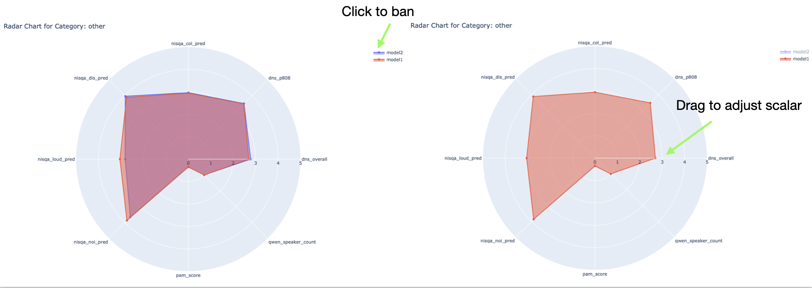

## Interactive Visualization of Versa Results
### Steps
* Additional Package Dependency Installation
```
pip install -r scripts/visualization/requirements.txt
```

* Aggregate the Results to Text Table
```
python scripts/show_result.py <your_path/results.jsonl> --export-csv
```

``--export-csv`` outputs ``./metrics_analysis.csv``

* Convert the csv Format
```
python scripts/visualization/build_metricsTree.py --input_file ./metrics_analysis.csv --output_file ./metrics_tree.csv
```

* Visualize the Sunburst Chart
```
python scripts/visualization/sunburst_chart.py --result_filepath metrics_tree.csv
```
Please also set ``--save_html Ture`` if your machine cannot directly forward port. Then download the
``html`` file to your local machine.


* Visualize the Radar Chart
Collect ``metrics_tree.csv`` of different models to ``output_csvs/*.csv``, then rename the csv files using model name.

Please specify either a sub category of versa metrics using ``--category`` or a set of metrics using ``--metrics``.
```
python scripts/visualization/radar_chart.py --data_dir output_csvs --category aesthetics

python scripts/visualization/radar_chart.py --data_dir output_csvs --metrics pesq,stoi,mosnet
```
Please also set ``--save_html Ture`` if your machine cannot directly forward port. Then download the
``html`` file to your local machine.

### Samples




### TODO
radar chart
