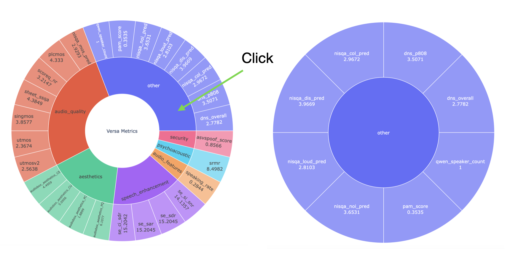

## Interactive Visualization of Versa Results
### Steps
* Additional Package Dependency Installation
```
pip install -r requirements.txt
```

* Aggregate the Results to Text Table
```
python scripts/show_result.py <your_path/results.jsonl> --export-csv
```

``--export-csv`` outputs ``./metrics_analysis.csv``

* Convert the csv Format
```
python scripts/visualization/build_metricsTree.py --input_file ./metrics_analysis.csv --output_file ./metrics_tree.csv
```

* Visualize Sunburst Chart
```
python scripts/visualization/sunburst_chart.py --result_filepath metrics_tree.csv
```
Please also set ``--save_html False`` if your machine cannot directly forward port. Then download the
``html`` file to your local machine.

### Samples


### TODO
radar chart